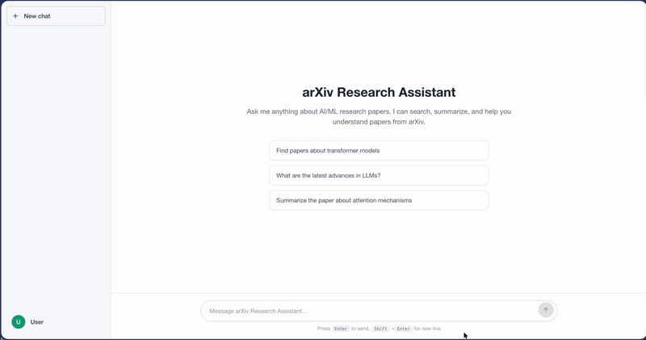
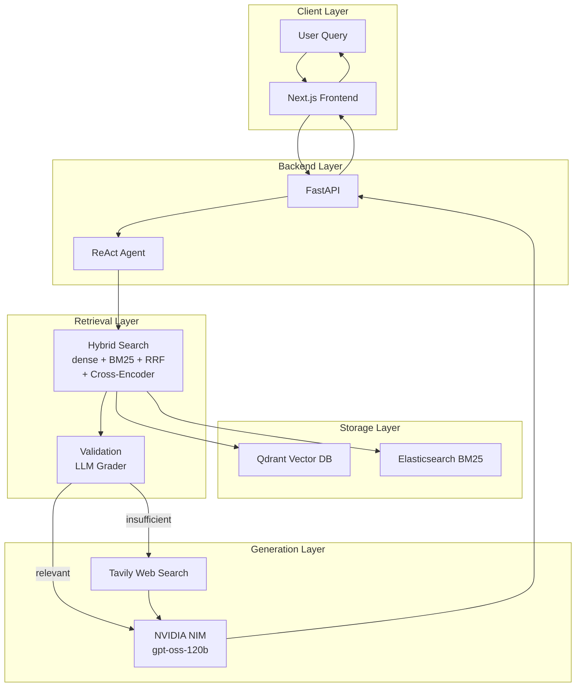
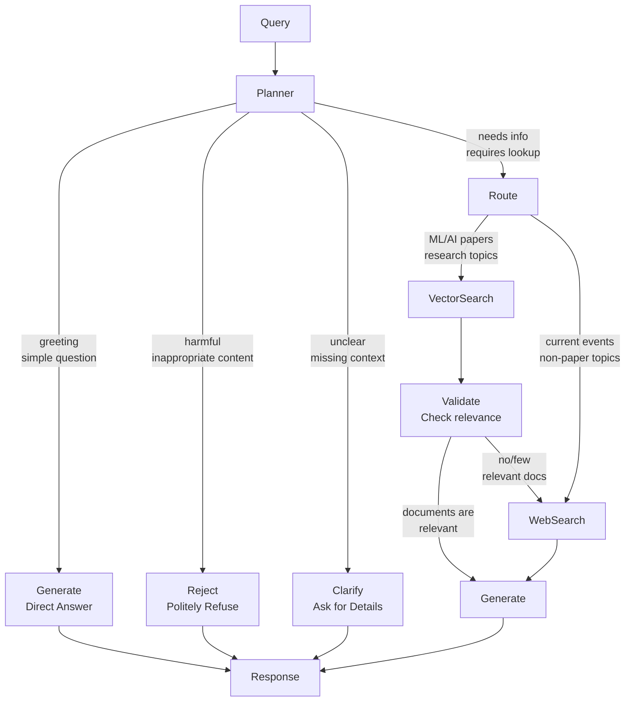
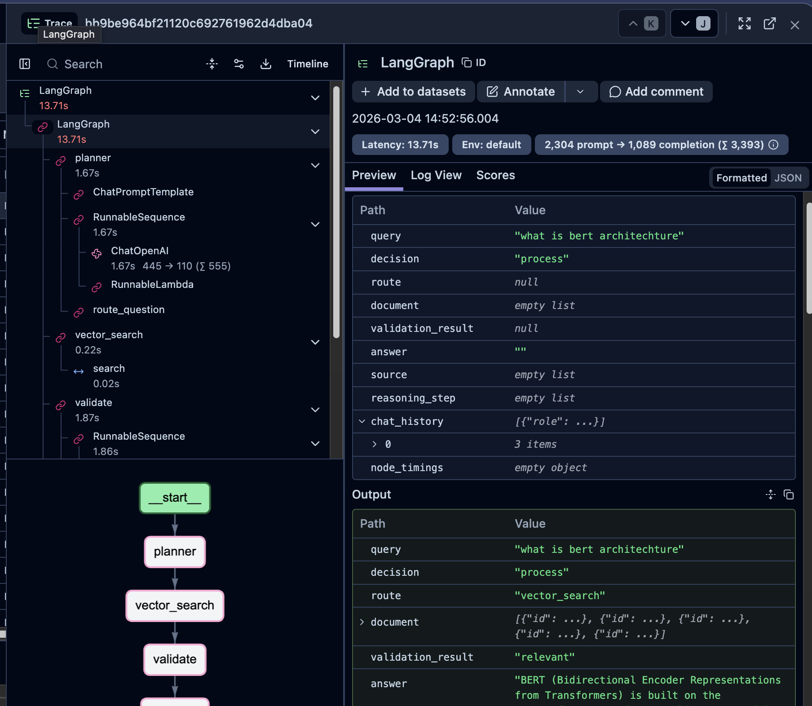

# AI Research Assistant Chatbot

Agentic RAG system for querying 100+ arXiv papers using AI agents and hybrid search.

---

## Demo



---

## Architecture

### System Overview



### Component Details

**1. Storage Layer**
- **Qdrant Vector Store**: Stores document embeddings for semantic search
- **Elasticsearch**: BM25 inverted index for keyword-based lexical search
- **Metadata Storage**: Paper IDs, titles, sections, chunk relationships

**2. Retrieval Layer**
- **Hybrid Retrieval**: Combines BM25 (lexical) and vector (semantic) search
  - Dense search: Qdrant (top-K=50)
  - BM25 search: Elasticsearch (top-K=50)
  - RRF (Reciprocal Rank Fusion): combines scores (top-K=20)
  - Cross-Encoder Rerank: ms-marco-MiniLM-L-6-v2 (top-K=5)
- **Document Validation**: LLM-based relevance grading
  - If relevant: proceed to generation
  - If insufficient: fallback to web search

**3. Generation Layer**
- **ReAct Agent**: LangGraph-based workflow with structured reasoning
- **NVIDIA NIM**: LLM inference (gpt-oss-120b)
- **Web Search Fallback**: Tavily for current events

**4. Interface Layer**
- **Next.js Frontend**: Next.js with streaming response
- **FastAPI Backend**: RESTful API with SSE streaming

**5. Observability & Evaluation**
- **Langfuse**: Tracks entire RAG pipeline
- **RAGAS**: Automated evaluation metrics

---

## Agent Workflow



### Decision Logic

| Decision | Condition | Action |
|----------|-----------|--------|
| **direct_answer** | Greeting ("hello", "hi") or simple question ("who are you") | Generate direct response without retrieval |
| **reject** | Harmful, inappropriate, or policy-violating content | Politely refuse |
| **clarify** | Ambiguous query, missing context | Ask user for clarification |
| **process** | Requires information lookup | Continue to routing |

### Routing Logic

| Route | Condition | Action |
|-------|-----------|--------|
| **vector_search** | Query about ML/AI papers, research topics | Search Qdrant + Elasticsearch |
| **web_search** | Current events, news, non-paper topics | Search Tavily |

### Validation Logic

| Result | Condition | Action |
|--------|-----------|--------|
| **relevant** | LLM confirms retrieved documents answer the query | Generate answer from context |
| **insufficient** | LLM confirms no/few relevant documents found | Fallback to Tavily web search |

### Node Flow

| Step | Node | Type | Description |
|------|------|------|-------------|
| 1 | Query | Start | User input |
| 2 | Planner | Decision | Classify: direct/reject/clarify/process |
| 3 | Route | Decision | Choose: vector_search / web_search |
| 4 | VectorSearch | Storage | Hybrid: dense + BM25 + RRF + Cross-Encoder rerank |
| 5 | Validate | Decision | Check relevance |
| 6 | WebSearch | External | Tavily fallback |
| 7 | Generate | Agent | Generate answer |
| 8 | Response | Output | JSON with answer + sources + trace |

---

## Project Structure

```
research-assistant-chatbot/
├── src/
│   ├── api/
│   │   ├── main.py              # FastAPI entrypoint
│   │   ├── models.py            # Pydantic models
│   │   ├── dependencies.py      # DI
│   │   └── route/
│   │       ├── chat.py           # Chat endpoints
│   │       └── health.py         # Health check
│   ├── agent/
│   │   ├── workflow.py          # LangGraph workflow
│   │   ├── state.py             # AgentState schema
│   │   ├── planner.py           # Query classification
│   │   ├── vector_search.py     # Hybrid search node
│   │   ├── validate.py          # Document grader
│   │   ├── web_search.py        # Tavily fallback
│   │   └── gen.py               # Answer generator
│   ├── retrieval/
│   │   └── hybrid_search.py     # Qdrant + ES + RRF
│   ├── config/
│   │   ├── settings.py          # Config dataclasses
│   │   ├── prompt.py            # System prompts
│   │   └── clients.py           # Service clients
│   └── evaluation/
│       └── ragas_evaluator.py   # RAGAS metrics
├── frontend/                     # Next.js app
├── script/                       # Indexing scripts
├── test/                        # Tests
├── docker-compose.yml
├── requirements.txt
└── README.md
```

---

## Features

- Hybrid Search: Dense (Qdrant) + BM25 (Elasticsearch) + RRF Fusion
- ReAct Agent: LangGraph-based workflow with structured reasoning
- Document Validation: LLM-based relevance grading
- Streaming Response: Real-time answer generation
- Session Management: Persistent chat history
- Observability: Langfuse tracing
- Evaluation: RAGAS metrics
- Web Search Fallback: Tavily for current events

---

## Technology Stack

| Component | Technology | Purpose |
|-----------|-----------|---------|
| LLM API | NVIDIA NIM (gpt-oss-120b) | Inference |
| Vector Store | Qdrant | Semantic search |
| Lexical Search | Elasticsearch (BM25) | Keyword search |
| Reranker | Cross-Encoder (ms-marco-MiniLM-L-6-v2) | Relevance reranking |
| Embeddings | Sentence-Transformers (all-MiniLM-L6-v2) | Dense embeddings |
| Agent Framework | LangGraph | Workflow orchestration |
| Backend API | FastAPI | REST API with streaming |
| Frontend | Next.js | Web UI |
| Observability | Langfuse | Tracing |
| Evaluation | RAGAS | Quality metrics |

---

## Evaluation

Evaluated using **RAGAS** (RAG Assessment) framework with 50 test queries.

| Metric | Score | Description |
|--------|-------|-------------|
| Faithfulness | 0.785 | How well the answer is grounded in the retrieved context |
| Answer Relevancy | 0.795 | How relevant the answer is to the question |
| Context Precision | 0.724 | Quality of retrieval ranking |
| Answer Similarity | 0.651 | Semantic similarity between generated answer and ground truth |

---

## Tracing

The system uses **Langfuse** for observability and tracing. Langfuse provides detailed insights into the entire RAG pipeline, including:

- Token usage and cost tracking
- Latency per component (retrieval, generation)
- Trace logs for debugging
- User feedback collection



---

## Setup

### Prerequisites

- Docker & Docker Compose (for Docker setup)
- NVIDIA NIM API Key
- Python 3.12+
- Node.js 16+ (for frontend)

### Option 1: Docker (Recommended)

**Note**: First run takes 10-20 minutes to build Docker images and process PDF indexing.

#### 1. Environment

```bash
cp .env.example .env
# Edit .env with required API keys
```

#### 2. Start Services

```bash
# Start all services (infrastructure + backend + frontend + indexing)
docker compose up -d

# View logs to monitor indexing process
docker compose logs -f backend
```

#### 3. Verify

- Frontend: http://localhost:3000
- Backend API: http://localhost:8000/docs
- Qdrant: http://localhost:6333/dashboard

---

### Option 2: Hybrid (Terminal + Docker)

#### 1. Environment

```bash
cp .env.example .env
# Edit .env with required API keys
```

#### 2. Install Dependencies

```bash
# Backend
pip install uv
uv venv .venv --python 3.12
uv sync

# Frontend
cd frontend
npm install
```

#### 3. Start Infrastructure

```bash
# Start Qdrant and Elasticsearch
docker compose up -d qdrant elasticsearch
```

#### 4. Index Data (run only once)

```bash
source .venv/bin/activate
python script/download_paper.py
python script/process_pdf.py
python script/qdrant.py recreate
python script/elasticsearch_index.py recreate
```

#### 5. Start Application

```bash
# Terminal 1: Backend
uv run uvicorn src.api.main:app --reload --port 8000

# Terminal 2: Frontend
cd frontend && npm run dev
```

Access: http://localhost:3000

---

## API Endpoints

### Chat

| Method | Endpoint | Description |
|--------|----------|-------------|
| POST | /api/chat | Send message, get JSON response |
| POST | /api/chat/stream | Streaming response (SSE) |
| GET | /api/chat/sessions/{id} | Get session history |
| DELETE | /api/chat/sessions/{id} | Delete session |

### Health

| Method | Endpoint | Description |
|--------|----------|-------------|
| GET | /api/health | Health check |
| GET | /docs | Swagger UI |

### Evaluation

| Method | Endpoint | Description |
|--------|----------|-------------|
| POST | /api/evaluation/run | Run RAGAS evaluation |

---

## Usage Example

```bash
curl -X POST http://localhost:8000/api/chat \
  -H "Content-Type: application/json" \
  -d '{"message": "What is BERT?", "session_id": "test-123"}'
```

Response:
```json
{
  "answer": "BERT is a transformer-based model...",
  "sources": [
    {"id": 1, "title": "BERT: Pre-training...", "score": 0.94, "source": "dense"}
  ],
  "reasoning_step": [
    "Router: process -> vector_search",
    "Retrieved: 5 documents",
    "Validation: relevant",
    "Generate: synthesized answer"
  ],
  "trace_id": "abc-123-xyz"
}
```

---

## Configuration

### Environment Variables

| Variable | Description | Default |
|----------|-------------|---------|
| NVIDIA_NIM_API_KEY | NVIDIA NIM API key | Required |
| NVIDIA_NIM_MODEL | LLM model | openai/gpt-oss-120b |
| NVIDIA_NIM_BASE_URL | NVIDIA NIM base URL | https://integrate.api.nvidia.com/v1 |
| QDRANT_URL | Qdrant URL | http://localhost:6333 |
| QDRANT_COLLECTION | Qdrant collection | arxiv_papers |
| ES_URL | Elasticsearch URL | http://localhost:9200 |
| ES_INDEX | Elasticsearch index | arxiv_papers |
| TAVILY_API_KEY | Tavily API key | Optional |
| RERANKER_TOP_K | Reranker top-k | 5 |
| RRF_K | RRF fusion k | 60 |

### Ports

| Service | Port | URL |
|---------|------|-----|
| Frontend | 3000 | http://localhost:3000 |
| Backend | 8000 | http://localhost:8000 |
| Qdrant | 6333 | http://localhost:6333 |
| Elasticsearch | 9200 | http://localhost:9200 |

---

## Troubleshooting

### Qdrant not working

```bash
docker compose logs qdrant
docker compose restart qdrant
```

### Elasticsearch health

```bash
curl http://localhost:9200/_cluster/health
# Should return "green" or "yellow"
```

### Backend cannot connect

```bash
docker compose logs backend
docker compose exec backend env | grep -E "NVIDIA|ES_|QDRANT"
```

### NVIDIA NIM API error

```bash
curl https://integrate.api.nvidia.com/v1/models \
  -H "Authorization: Bearer $NVIDIA_NIM_API_KEY"
```
