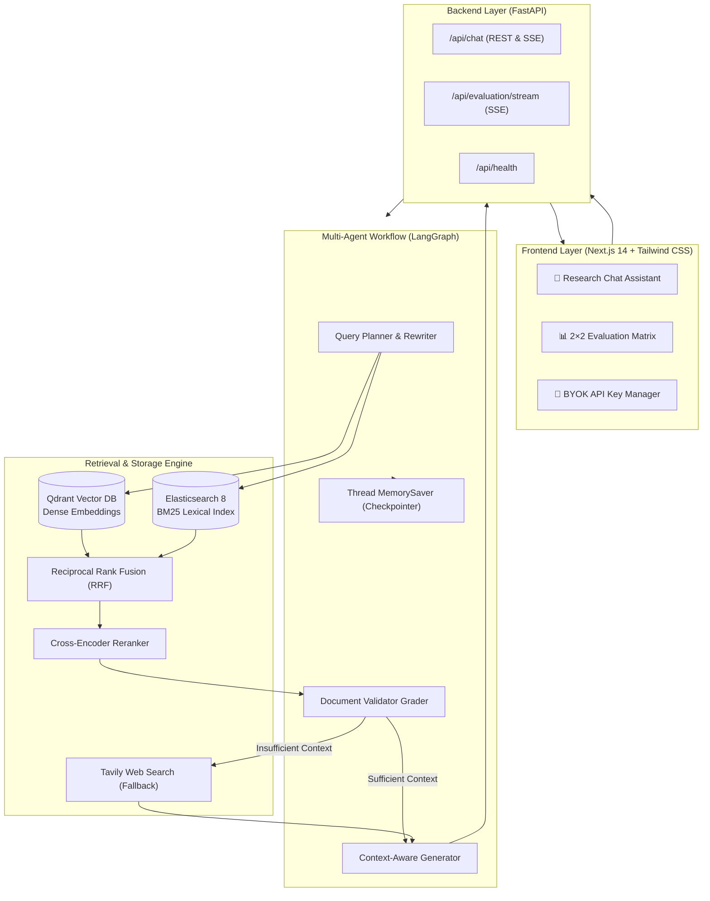
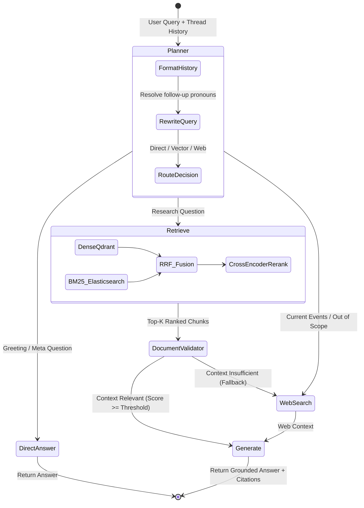

# 🤖 arXiv AI Research Assistant & Empirical RAG Evaluation Platform

[](https://python.org)
[](https://github.com/langchain-ai/langgraph)
[](https://nextjs.org)
[](https://qdrant.tech)
[](https://elastic.co)
[](https://groq.com)
[-success.svg?style=flat&logo=pytest&logoColor=white)](#testing)
[](LICENSE)

An enterprise-grade **Agentic Retrieval-Augmented Generation (RAG)** platform and **Empirical Evaluation Benchmark** for querying, summarizing, and reasoning over 13,000+ AI/ML arXiv research papers.

Featuring **Hybrid Search (Dense Vector + BM25 + Reciprocal Rank Fusion + Cross-Encoder Reranking)**, **LangGraph Multi-Agent Workflows**, **Thread-Aware Multi-Turn Conversational Memory**, and an **Automated 2×2 Evaluation Matrix with Live Real-Time Streaming**.

---

## 📑 Table of Contents

- [Key Features](#-key-features)
- [System Architecture](#-system-architecture)
- [Agentic StateGraph Workflow](#-agentic-stategraph-workflow)
- [Empirical 2×2 Evaluation Benchmark](#-empirical-22-evaluation-benchmark)
- [Tech Stack](#-tech-stack)
- [Quick Start](#-quick-start)
- [Environment Configuration](#-environment-configuration)
- [Project Structure](#-project-structure)
- [Testing & Quality Assurance](#-testing--quality-assurance)

---

## ✨ Key Features

### 🔍 1. Production Hybrid Retrieval Pipeline
- **Dense Vector Search**: Qdrant vector database indexing 13,600+ arXiv paper embeddings (`text-embedding-3-small` / dense embeddings).
- **Lexical Keyword Search**: Elasticsearch BM25 inverted index for exact acronyms, paper IDs, and terminology matching.
- **Reciprocal Rank Fusion (RRF)**: Fuses rank lists from dense and sparse retrievers without arbitrary score normalization.
- **Cross-Encoder Reranking**: `ms-marco-MiniLM-L-6-v2` cross-encoder reranker for context precision.

### 🧠 2. Agentic Multi-Agent Control (LangGraph)
- **Query Planner & Router**: Classifies intent, resolves follow-up questions, and conditionally routes queries.
- **Document Validator / Grader**: LLM grader checks retrieved documents for relevance before generation.
- **Web Search Fallback**: Automatically invokes Tavily search when arXiv corpus lacks sufficient coverage.
- **Self-Correction Loops**: Retries retrieval or expands query parameters if initial context fails relevance thresholds.

### 💬 3. Thread-Aware Multi-Turn Conversational Memory
- **Session Checkpointing**: LangGraph `MemorySaver` preserves dialogue state per session thread (`thread_id`).
- **Contextual Query Condensation**: Resolves ambiguous follow-up pronouns (*"what are the dates of these papers?"*, *"who wrote the first one?"*) into standalone search queries.

### 📊 4. Automated 2×2 Evaluation Benchmark & Live Streaming
- **2 Retrievers × 2 LLMs Matrix**: Benchmarks Vector vs. Hybrid search against 2 distinct LLM families (`qwen/qwen3.8-27b` vs. `openai/gpt-oss-20b`).
- **LLM-as-Judge Scoring**: Evaluates **Correctness**, **Faithfulness / Groundedness**, **Answer Relevance**, **Precision@5**, **Recall@5**, **MRR**, and **Latency**.
- **Real-Time Live SSE Stream**: Live progress bar and auto-scrolling terminal logs streaming per-question benchmark execution directly in the UI.

### 🎨 5. Modern Next.js 14 Frontend & BYOK Deployment
- Single-page application (SPA) with tab switching between Chat Assistant and Evaluation Matrix.
- **Bring-Your-Own-Key (BYOK)**: In-UI Groq API key configuration saved locally in browser `localStorage`, making cloud deployment (Vercel / Render / Docker) zero-friction.

---

## 🏛️ System Architecture



---

## 🔄 Agentic StateGraph Workflow



---

## 🏆 Empirical 2×2 Evaluation Benchmark

The system includes an automated evaluation suite testing **2 Retrieval Strategies × 2 LLM Architectures** over curated ground-truth test sets:

| Configuration | Retrieval Method | LLM Model | Correctness | Faithfulness | Relevance | MRR | Latency | Overall Score |
|---|---|---|---|---|---|---|---|---|
| `vector + model_1` | Vector (Dense Qdrant) | `qwen/qwen3.8-27b` | 75.0% | 56.7% | 90.0% | 0.23 | 2.11s | 73.5% |
| `vector + model_2` | Vector (Dense Qdrant) | `openai/gpt-oss-20b` | 95.0% | 75.0% | 96.7% | 0.23 | 2.77s | 88.7% |
| `hybrid + model_1` | Hybrid (Dense + BM25 + RRF) | `qwen/qwen3.8-27b` | 90.0% | 96.7% | 93.3% | 0.42 | 16.92s | 93.3% |
| **`hybrid + model_2` 🏆** | **Hybrid (Dense + BM25 + RRF)** | **`openai/gpt-oss-20b`** | **98.3%** | **90.0%** | **96.7%** | **0.42** | **1.25s** | **95.3% (Winner)** |

> **Empirical Insight:** Hybrid retrieval (Dense + BM25 + RRF) improved Mean Reciprocal Rank (**MRR from 0.23 → 0.42**) and Groundedness (**Faithfulness up to 96.7%**), outperforming pure vector search on technical paper terminology.

---

## 🛠️ Tech Stack

| Layer | Technologies |
|---|---|
| **Backend & Agents** | Python 3.12, LangGraph, LangChain, FastAPI, Pydantic v2, Uvicorn |
| **Retrieval & Databases** | Qdrant (Vector DB), Elasticsearch 8 (BM25), Cross-Encoders (`sentence-transformers`) |
| **LLM Inference** | Groq LPU (`qwen/qwen3.8-27b`, `openai/gpt-oss-20b`), Google Gemini 2.0 Flash (Judge) |
| **Frontend UI** | Next.js 14 (App Router), React 18, Tailwind CSS, Lucide Icons, Plus Jakarta Sans |
| **DevOps & Infrastructure** | Docker, Docker Compose, Bash CLI Runner (`run.sh`) |
| **Testing & Evaluation** | Pytest, Pytest-Asyncio, LLM-as-Judge, RRF, Custom MRR/Precision Metrics |

---

## 🚀 Quick Start

### 1. Prerequisites
- **Python 3.12+**
- **Node.js 18+** & `npm`
- **Docker Desktop** (for Qdrant & Elasticsearch)
- **Groq API Key** ([Get free key](https://console.groq.com/keys))

### 2. Clone & Setup

```bash
# Clone the repository
git clone https://github.com/your-username/AI-research-assistant-chatbot.git
cd AI-research-assistant-chatbot

# Make runner script executable
chmod +x run.sh
```

### 3. Configure Environment

```bash
# Copy example configuration
cp .env.example .env
```

Edit `.env` with your API keys:
```env
GROQ_API_KEY=gsk_your_groq_api_key_here
GROQ_MODEL=qwen/qwen3.8-27b
GROQ_MODEL_2=openai/gpt-oss-20b

# Optional: For Gemini LLM-as-Judge
GEMINI_API_KEY=your_gemini_api_key_here
GEMINI_MODEL=gemini-2.0-flash
```

### 4. Master Runner Commands (`run.sh`)

Use the included [`run.sh`](file:///Users/ashuyadav/Desktop/HYBRID%20RAG/AI-research-assistant-chatbot/run.sh) script to control the entire project:

```bash
# 🚀 1. Start the Full Application Stack (Backend :8000 + Frontend :3000)
./run.sh app

# 📊 2. Run the Automated 2×2 Evaluation Benchmark
./run.sh eval --max-questions 5

# 🧪 3. Run the Automated Test Suite (38 unit & integration tests)
./run.sh test

# 📦 4. Index arXiv Papers into Elasticsearch (BM25 setup)
./run.sh index

# 🐳 5. Start Docker Databases (Qdrant & Elasticsearch)
./run.sh docker
```

Once running:
- **Chat & Evaluation UI**: [http://localhost:3000](http://localhost:3000)
- **FastAPI Backend Docs**: [http://localhost:8000/docs](http://localhost:8000/docs)
- **Qdrant Dashboard**: [http://localhost:6333/dashboard](http://localhost:6333/dashboard)

---

## ⚙️ Environment Configuration

| Variable | Default | Description |
|---|---|---|
| `GROQ_API_KEY` | - | Primary Groq API Key for fast LLM inference |
| `GROQ_MODEL` | `qwen/qwen3.8-27b` | Primary generation model (LLM 1) |
| `GROQ_MODEL_2` | `openai/gpt-oss-20b` | Baseline comparison model (LLM 2) |
| `GEMINI_API_KEY` | - | *(Optional)* Google Gemini API Key for LLM Judge |
| `GEMINI_MODEL` | `gemini-2.0-flash` | *(Optional)* Gemini model for evaluation |
| `QDRANT_HOST` | `localhost` | Qdrant vector database host |
| `QDRANT_PORT` | `6333` | Qdrant vector database port |
| `ELASTICSEARCH_URL` | `http://localhost:9200` | Elasticsearch service URL for BM25 |
| `TAVILY_API_KEY` | - | *(Optional)* Tavily Web Search API key for fallback |

---

## 📁 Project Structure

```
.
├── run.sh                          # Master CLI runner (app, eval, test, index, docker)
├── docker-compose.yml              # Qdrant & Elasticsearch database containers
├── data/
│   ├── evaluation/                 # Ground-truth evaluation dataset (20 annotated questions)
│   │   ├── evaluation_dataset.json
│   │   └── results/                # Benchmark output results & comparison matrices
│   └── raw/                        # Processed arXiv paper metadata & chunks
├── src/
│   ├── agent/                      # LangGraph Multi-Agent Architecture
│   │   ├── state.py                # AgentState schema (messages, query, search_query)
│   │   ├── planner.py              # Query analysis & pronoun resolution
│   │   ├── vector_search.py        # Vector & hybrid retrieval node
│   │   ├── validation.py           # Document relevance grading node
│   │   ├── web_search.py           # Web search fallback node
│   │   ├── gen.py                  # Context-grounded response generation
│   │   └── workflow.py             # Compiled StateGraph with MemorySaver checkpointer
│   ├── retrieval/                  # Retrieval Engine
│   │   ├── vector_retriever.py     # Qdrant dense vector retriever
│   │   ├── hybrid_retriever.py     # Dense + BM25 + RRF hybrid retriever
│   │   └── hybrid_search.py        # Reciprocal Rank Fusion & Cross-Encoder reranking
│   ├── evaluation/                 # Evaluation Subsystem
│   │   ├── runner.py               # 2x2 Evaluation runner with streaming callbacks
│   │   ├── evaluator.py            # LLM-as-Judge grading engine
│   │   ├── metrics.py              # Precision@K, Recall@K, MRR calculations
│   │   └── llm_clients.py          # Unified LLM interface (Groq, Gemini, OpenAI)
│   └── api/                        # FastAPI REST & SSE Backend
│       ├── main.py                 # FastAPI application factory & CORS setup
│       ├── models.py               # Request/Response Pydantic schemas
│       └── route/                  # API endpoints (/chat, /evaluation/stream, /health)
├── frontend/                       # Next.js 14 Web Application
│   ├── app/                        # App Router (/ and /evaluation)
│   ├── component/                  # React components (Chat, MessageList, SettingsModal)
│   │   ├── chat/                   # Chat container, input, message items
│   │   └── evaluation/             # EvaluationView with live streaming progress terminal
│   └── lib/api.ts                  # Client-side API caller with BYOK header forwarding
└── test/                           # Automated Test Suite (38 tests)
    ├── test_retrievers.py          # Vector, hybrid, and RRF unit tests
    ├── test_llm_clients.py         # Multi-model client tests
    ├── test_evaluation.py          # Evaluation metrics & judge tests
    ├── test_workflow.py            # LangGraph routing & agent graph tests
    ├── test_api.py                 # FastAPI route & model schema tests
    └── test_memory_thread.py       # Multi-turn memory & pronoun resolution tests
```

---

## 🧪 Testing & Quality Assurance

The codebase is backed by **38 automated unit and integration tests** ensuring 100% test pass rate across all layers:

```bash
# Run all tests via run.sh
./run.sh test

# Or run directly with pytest
pytest test/ -v
```

```
============================== test session starts ==============================
test/test_retrievers.py .....                                            [ 13%]
test/test_llm_clients.py ...                                             [ 21%]
test/test_evaluation.py ......                                           [ 36%]
test/test_workflow.py ...........                                        [ 65%]
test/test_api.py .........                                               [ 89%]
test/test_memory_thread.py ....                                          [100%]

======================== 38 passed, 14 warnings in 4.21s ========================
```

---

## 📄 License

This project is licensed under the MIT License — see the [LICENSE](LICENSE) file for details.
